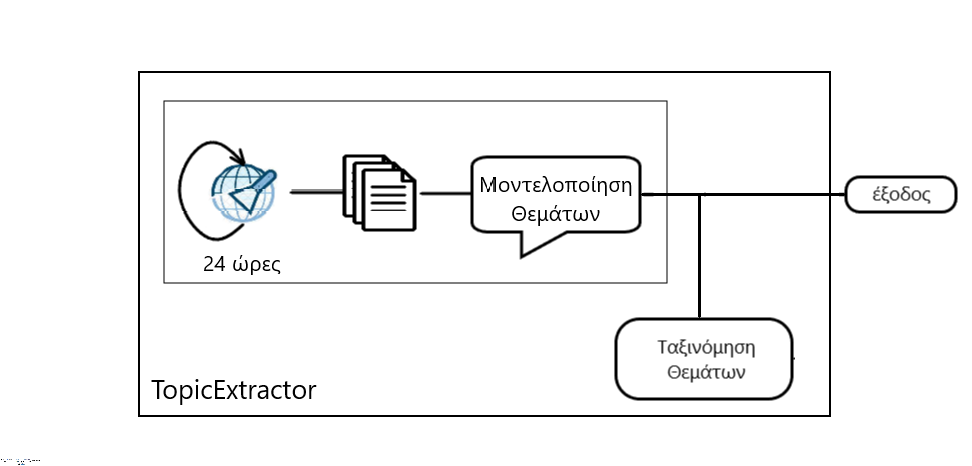
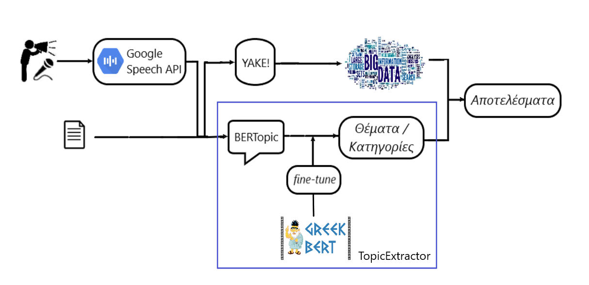
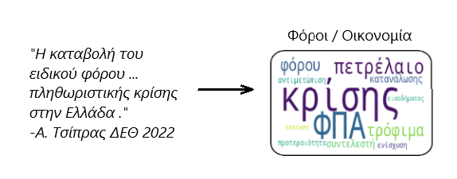

# TopicExtractor

TopicExtractor is a system that provides topic modelling on news articles and political speeches.
It consists of two major concepts. While examining articles, it processes texts per paragraph. While examining speeches, the processed part is the one provided (as the output) by the Google Speech To Text API every time during the recording. Both of them form the system's input.

Firstly, the input is assigned to a specific topic (which is recognized by the topic model) and afterwards the resulting topic is assigned to its corresponding news category (1 out of the 12 main categories). For the first task BERTopic method is implemented and for the classification task the greek version of BERT (greek-BERT) was fine-tuned to perform it.

TopicExtractor is a part of a whole system that gives to end-users the ability to:
* compose an article
* dictate a text and
* record a speech

In all three scenarios, the results are returned to users with the presence of a graphic illustration that contains the corresponding keywords (being written or spoken) in a WordCloud format. In case of speeches, these also include timestamps to determine the suitable time spot. 

